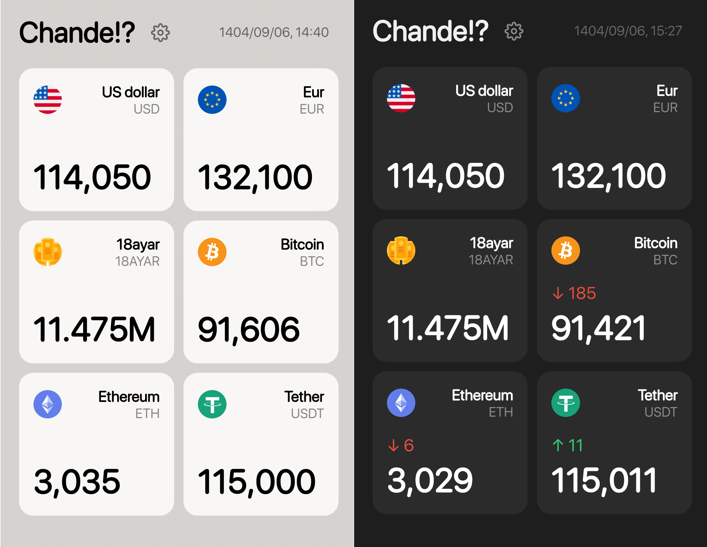

  
  
  

---

## 📑 Table of Contents

- [Overview](#-overview)
- [Key Features](#-key-features)
- [How to Install](#-how-to-install)
- [Data Source](#-data-source)
- [Contribute](#-contribute)
- [Credits](#-credits)

---

## 🌟 Overview
**Chande?!** is a fast, lightweight, and minimal web application for tracking real-time currency and cryptocurrency prices. Built as a Progressive Web App (PWA), it can be installed on any device. With its clean interface, you can customize your dashboard, choose your preferred currencies, adjust card sizes, switch between light and dark themes, and monitor price changes — all in one place.

---

  

  <i>Inspired by the <a href="https://apps.apple.com/us/app/chand/id1524200188">Chand!?</a> iOS app</i>

---

## 🎯 Key Features

| Feature | Description |
|---------|-------------|
| 📊 **Live Exchange Rates** | Real-time currency and crypto prices updated regularly |
| 🎨 **Customizable Cards** | Add or remove currencies and adjust card sizes to your liking |
| 🔍 **Quick Search** | Find any currency instantly with built-in search functionality |
| 🌓 **Dark/Light Mode** | Toggle between dark and light themes from the settings |
| 📈 **Price Changes** | Track how prices have changed since your previous visit |
| 📱 **PWA Support** | Install on your device and use offline like a native app |
| 🔄 **Reverse Colors** | Option to reverse price change colors based on your preference |

---

## 🚀 How to Install

1. Simply visit the following URL:

🔗 https://certmusashi.github.io/Chande/

2. Once the page loads, select **Add to Home Screen** or **Install** to install the app on your device.

---

## 📡 Data Source

Currency and cryptocurrency prices are fetched from the [Chande-api](https://github.com/CertMusashi/Chande-api).

---

---

## 🤝 Contribute

We welcome contributions from the community! Here's how to get involved:

1. **Fork** the repository
2. **Create** a new branch: `git checkout -b feature/YourFeature`
3. **Commit** your changes: `git commit -m 'Add YourFeature'`
4. **Push** to your branch: `git push origin feature/YourFeature`
5. **Submit** a Pull Request

Feel free to open an issue for bug reports or feature requests.

---

## ✨ Credits

Developed by **[CertMusashi](https://github.com/CertMusashi)**
